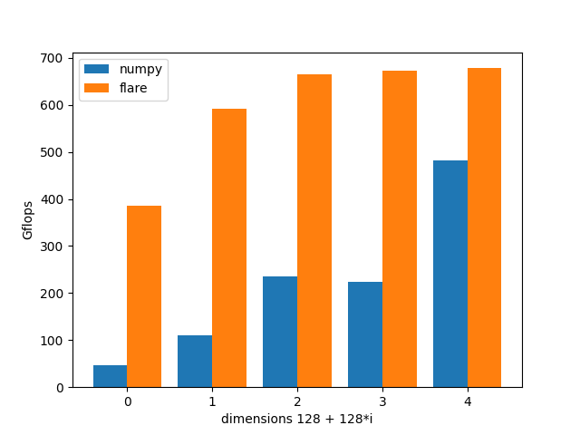
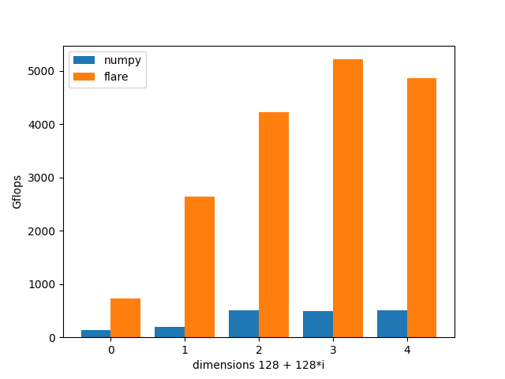

flare
====

flare is a high-performance tensor processing basic component library of `EA`. In the field of `vector search` technology, 
search, recommendation and advertising will eventually settle on the calculation of tensors. One aspect of flare is to
abstract tensor operations to an operation plane, such as tensor distance calculation, delay expression (to facilitate 
operator fusion in the future), matrix multiplication and other basic operations. On the other hand, the tensor operations
of different devices are abstracted to an operation plane, such as CPU and CUDA. When the business layer is used, it 
reduces the consumption of the system design layer and focuses on the design of algorithms and the improvement of 
algorithm quality.

# several goals
* High performance
* Support cpu and gpu
* Standard math
* Vector algorithms
* Machine learning
* Linear algebra
* unified api

flare also can work as a plugin to [hercules](https://github.com/gottignen/hercules).

flare provides software developers with a high-level abstraction of data that resides on the 
accelerator, the `flare::tensor`object. Developers write code that performs operations on flare
arrays, which, in turn, are automatically translated into near-optimal kernels that execute on 
the computational device.

# try online 

# benchmark

# install
When designing flare, we fully considered the convenience of the deployment in the production 
environment and the R&D environment. Considering different dimensions, we provide corresponding 
solutions, especially in the R&D environment based on large-scale servers and the consistency of 
deployment. For detailed compilation and installation process, please refer to [build and install](docs/en/linux_build.md)

# user

* [tann](https://github.com/gottignen/titan-ann) knn search application.

# supports
* [collie](https://github.com/gottignen/collie) basic c++ header only library.
* [carbin](https://github.com/gottignen/carbin)  a simple package and cmake template manger.

