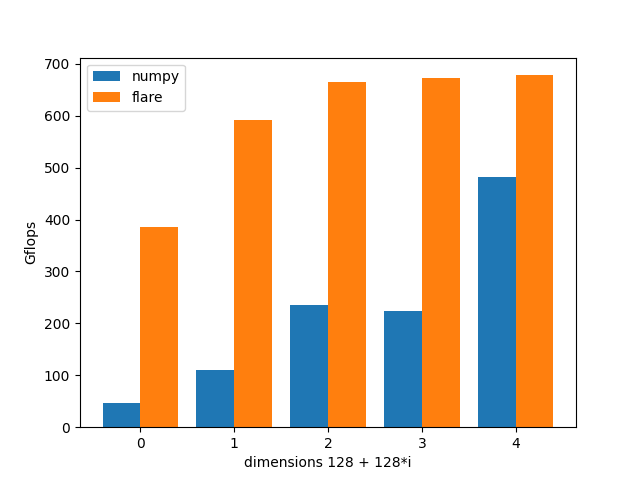
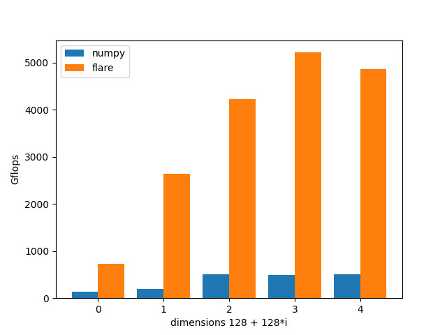

.. Copyright 2023 The EA Search Authors.
.. Licensed under the Apache License, Version 2.0 (the "License");

..  image:: image/ticon.png
    :height: 200px
    :width: 240 px
    :scale: 80 %
    :align: center
    :alt: flare

flare is a high-performance tensor processing basic component library of `EA`. In the field of `vector search` technology,
search, recommendation and advertising will eventually settle on the calculation of tensors. One aspect of flare is to
abstract tensor operations to an operation plane, such as tensor distance calculation, delay expression (to facilitate
operator fusion in the future), matrix multiplication and other basic operations. On the other hand, the tensor operations
of different devices are abstracted to an operation plane, such as CPU and CUDA. When the business layer is used, it
reduces the consumption of the system design layer and focuses on the design of algorithms and the improvement of
algorithm quality.

# several goals
* High performance
* Support cpu and gpu
* Standard math
* Vector algorithms
* Machine learning
* Linear algebra
* unified api

see the benchmark on cpu vs numpy

see the benchmark on gpu vs numpy

Contents
--------

.. toctree::
    :caption: ABOUT

.. toctree::
    :caption: GET START

.. toctree::

.. toctree::
    :maxdepth: 3
    :caption: TUTORIAL

